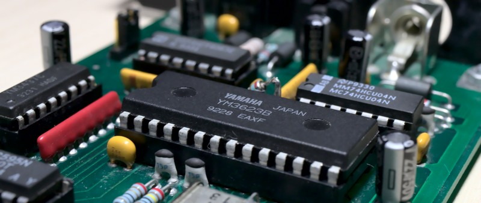

# maestix.library

Maestix is a shared Amiga library that drives the MaestroPro sound board by MacroSystem.

This is not the official MaestroPro driver. There never has been one. Originally that board could only be used by a small handful of proprietary tools that came included with the MaestroPro, or were sold separately. I always wanted to use the sound board for my own purposes, so one day I decided to obtain the datasheets of the Yamaha chips, do some measurements of the hardware, and then write my own driver based on that reverse engineering. The Maestix library is the result of that endeavor. Over the years it grew to the de-facto driver for the MaestroPro.

The source code was closed, like almost all of my Amiga projects. I have now reviewed and reformatted the files, translated the comments from German to English, added English documentation, and made the project compilable on Linux (and probably other targets) using vbcc. The source is now open to everyone for using, studying, archivation, or just enjoying the good old Amiga times.

## Features

* Digital playback and recording, even in full-duplex mode.
* AHI driver is included.
* Comes with a MUI based RealTime utility and an MPEG audio player.
* Supports S/P-DIF and AES/EBU (studio mode) Channel Status Bits.
* 16 realtime audio effects, custom realtime effects are possible.
* Channel Status Bits and User Data Bits can be individually set.
* Very easy to use. No hardware knowledge about MaestroPro is required.
* VMM compatible, no hacks, no muforce, no mungwall, and no patchwork hits.
* Requires 68020 or higher. 68060 and DraCo compatible.
* GPL licensed, open source.
* Source Code is available at [GitHub](https://github.com/shred/maestix).

## Building from Source

This project is mainly made to be build on Linux machines. However, with a few modifications it can also be built on AmigaOS and other operating systems.

Requirements:

* [GNU make](http://www.gnu.org/software/make/) or another compatible make tool
* [vbcc](http://www.compilers.de/vbcc.html) with [fd2pragma](https://github.com/adtools/fd2pragma)
* [AmigaOS NDK 3.2](https://www.hyperion-entertainment.com/index.php/downloads?view=files&parent=40), unpacked on your build machine
* [mpega.library](http://aminet.net/package/util/libs/mpega_library) by Stéphane Tavenard
* [MUI](http://sasg.com/mui/download.html) by Stefan Stuntz
* [Lamp.mcc](http://aminet.net/package/dev/mui/MCC_Lamp) by Maik Schreiber
* [lha](https://github.com/jca02266/lha)

Set the `AMIGA_NDK` env variable to the location of the unpacked `NDK3.2` directory on your build machine. Also set `AMIGA_INCLUDES` to the location of 3rd party include files, where the mpega and MUI includes can be found.

Then just invoke `make` to build the project. The compiled project can be found in the `build` directory. `make release` will compile a release version in the `release` directory.

Today's standard encoding is UTF-8. Unfortunately AmigaOS does not support this encoding, so the files in this project have different encodings depending on their purpose. The assembler and C files must use plain ASCII encoding, so they can be edited on Linux and Amiga without encoding problems. For special characters in strings, always use escape sequences. Do not use special characters in comments. `make check` will test if these files contain illegal characters. All purely Amiga-related files (like AmigaGuide files) are expected to be ISO-8859-1 encoded. Then again, `README.md` (and other files related to the open source release) are UTF-8 encoded. If you are in doubt, use plain ASCII.

## Contribution and Releases

The source code of this project can be found [at the official GitHub page](https://github.com/shred/maestix).

If you found a bug or have a feature request, feel free to [open an issue](https://github.com/shred/maestix/issues) or [send a pull request](https://github.com/shred/maestix/pulls).

Official binaries are available [at AmiNet](http://aminet.net/package/driver/audio/Maestix).

**Please keep the "Maestix" package name reserved for official releases. If you want to release a fork, use a different package name.**

## Broken MaestroPro and Toccata boards

If you need help with repairing your MaestroPro or Toccata board, please contact me.

I was able to read the fusemaps of all GALs on both boards, so I can now refresh old GALs, or burn new ones. Please understand that the fusemaps are still copyrighted by MacroSystem, so I am not permitted to publish them. Also note that I don't have the fusemaps of other MacroSystem boards.

If you intend to discard your sound board because it is not functional, please get in contact with me first.

## Why is there no 68000 version?

With a tiny modification to the `makefile`, an 68000 version can be built. However, due to the large amount of data moved between the driver and the MaestroPro card, it doesn't really make much fun to use it on an 68000 processor. If you really need an 68000 version, you can build it yourself from this source, or get in contact with me.

## License

`Maestix` is distributed under GPLv3 ([Gnu Public License](http://www.gnu.org/licenses/gpl.html)).
